# Job Finder App

A mobile application built with **React Native** (Expo) and **Firebase** that allows users to browse jobs, bookmark them, and receive notifications when new jobs are posted.

## Features

- 🔎 **Search & Browse Jobs**  
  View recent job postings by category, company, or keywords.

- 🏢 **Company Profiles**  
  Explore company details and open positions.

- 🔔 **Notifications**  
  Users can enable notifications to receive alerts when new jobs are added.  
  - New jobs trigger a real-time alert.  
  - A badge icon shows the number of unread notifications.  
  - Users can open the notifications page and mark jobs as read.  
  - Option to **clear all notifications**.

- 📌 **Bookmarks**  
  Save jobs for later review.

- 🎨 **Customizable Theme**  
  Light/Dark theme support.

## Tech Stack

- **React Native (Expo)**
- **Firebase Authentication** (login & user profiles)
- **Firestore** (jobs, companies, notifications)
- **React Navigation** (stack + bottom tabs)
- **TypeScript**

## Project Structure

```

/screens
/home        -> HomeScreen, NotificationsScreen
/companies   -> Companies, CompanyDetail
/search      -> Search jobs
/activity    -> User activity
/profile     -> Profile, Theme, About, Notification settings
/components    -> Reusable UI components (JobCard, SectionHeader, etc.)
/models        -> Data models & converters
/design        -> Theme + DesignProvider

````
## Preview

<table>
  <tr>
    <td>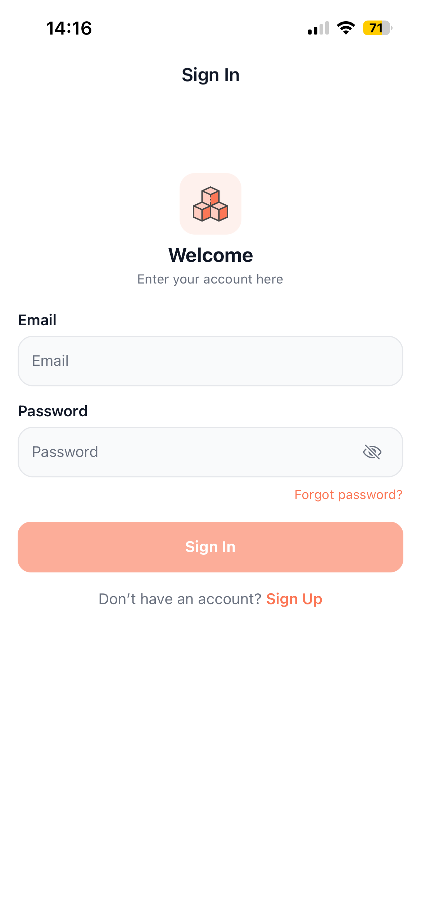</td>
    <td>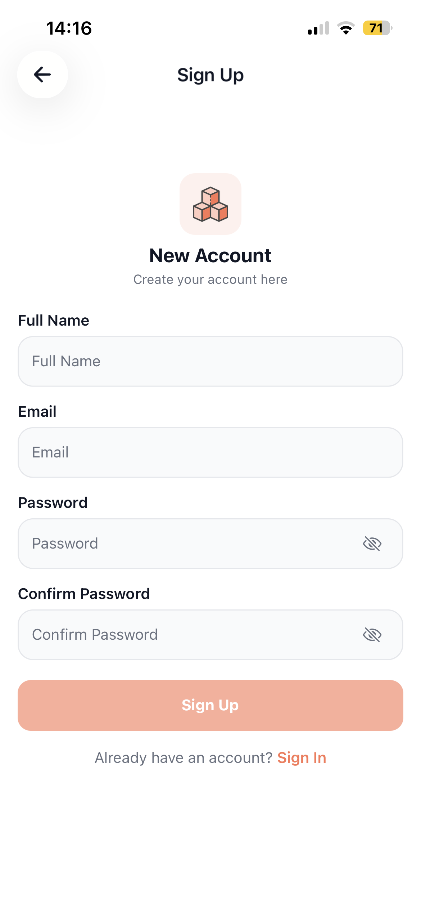</td>
    <td>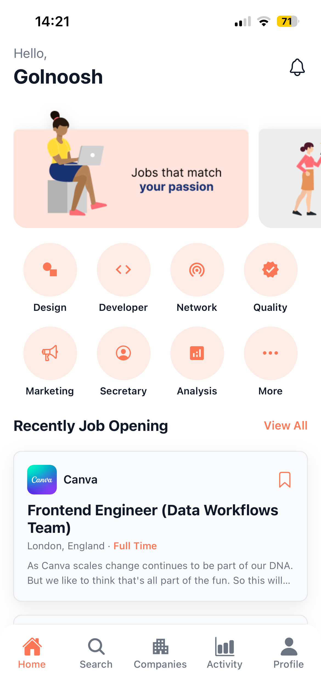</td>
  </tr>
  
  <tr>
    <td>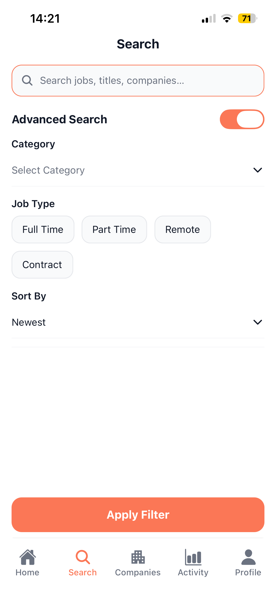</td>
    <td>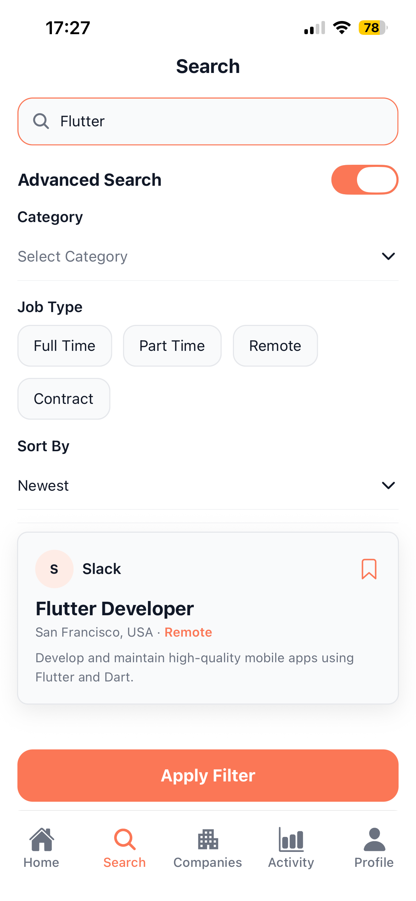</td>
    <td>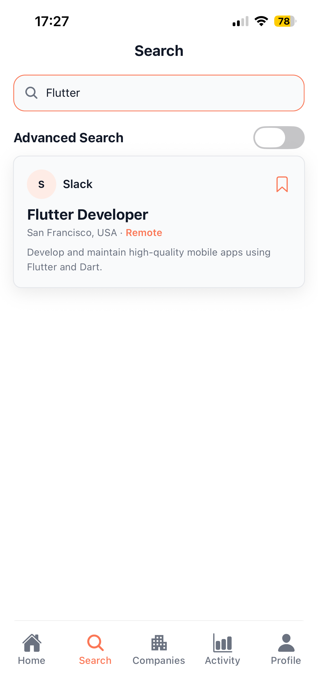</td>
  </tr>
  
  <tr>
    <td>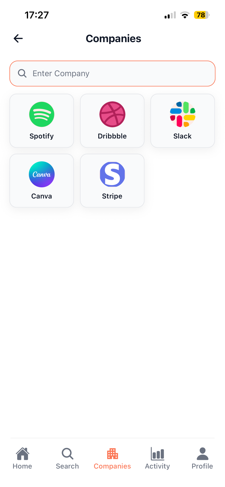</td>
    <td>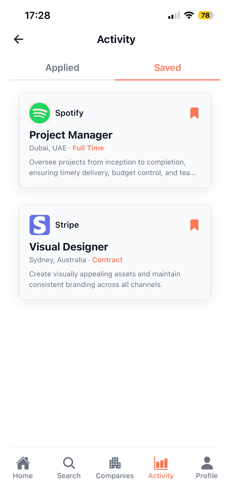</td>
    <td>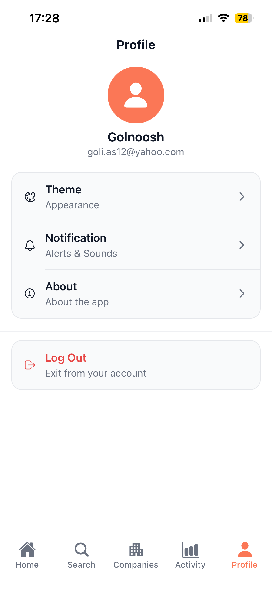</td>
  </tr>
 
  <tr>
    <td></td>
    <td></td>
    <td>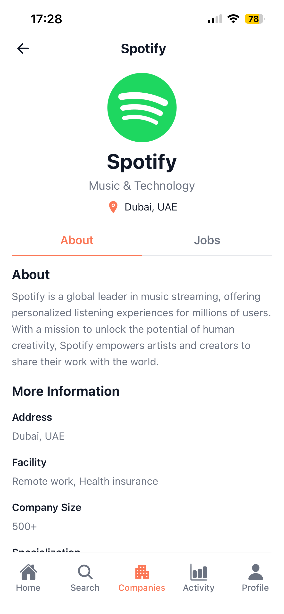</td>
  </tr>
  
  <tr>
    <td>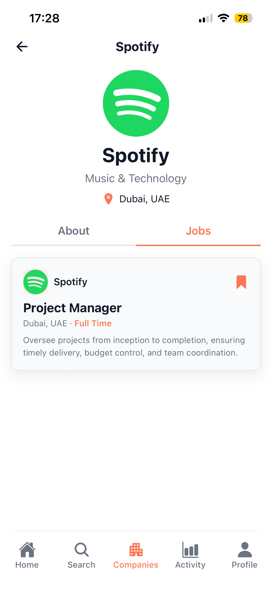</td>
    <td>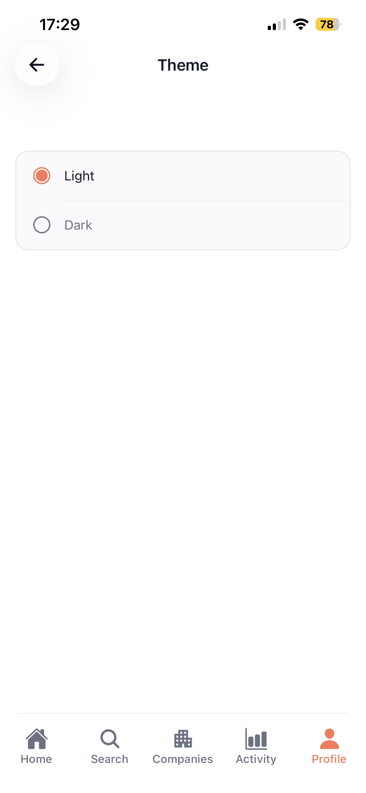</td>
    <td>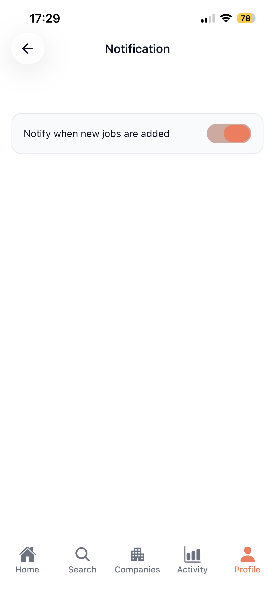</td>
  </tr>
  
  <tr>
    <td>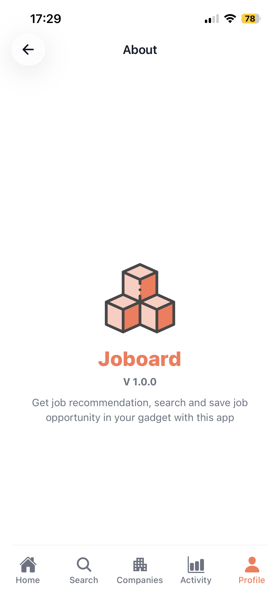</td>
    <td>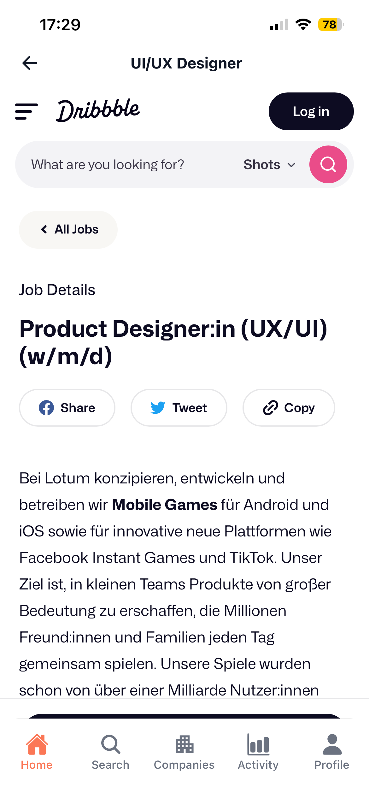</td>
    <td></td>
  </tr>
    
  <tr>
    <td>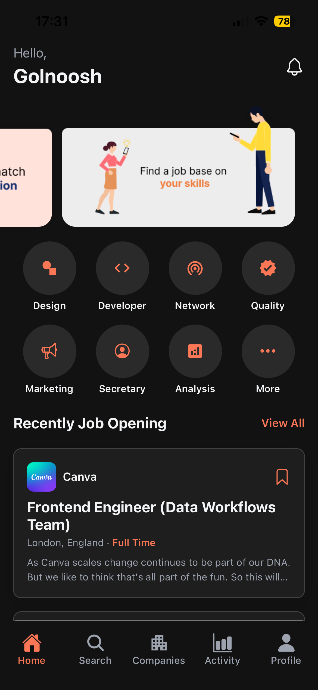</td>
    <td>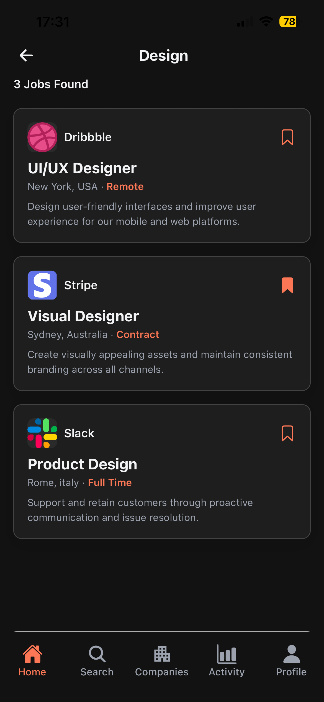</td>
    <td>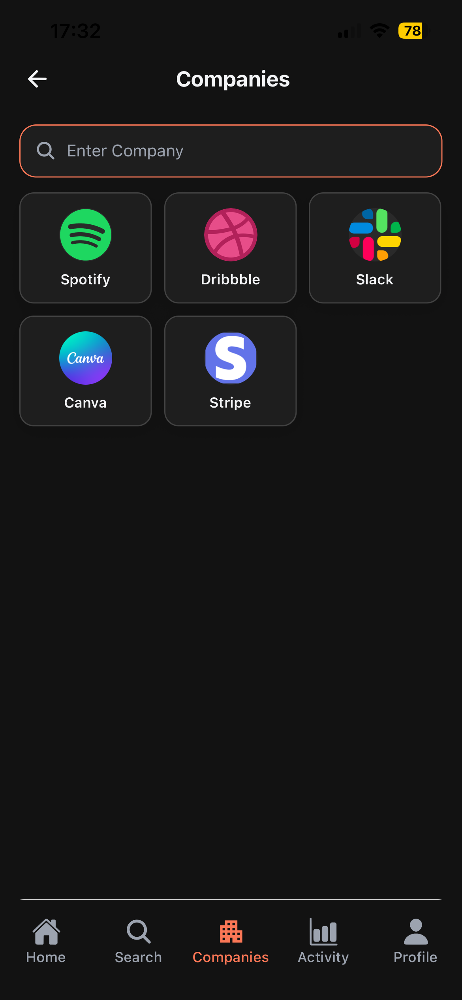</td>
  </tr>

  <tr>
    <td>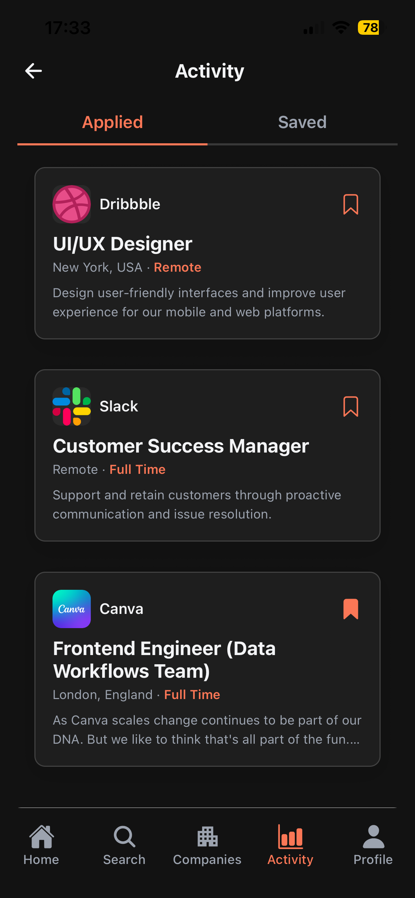</td>
    <td>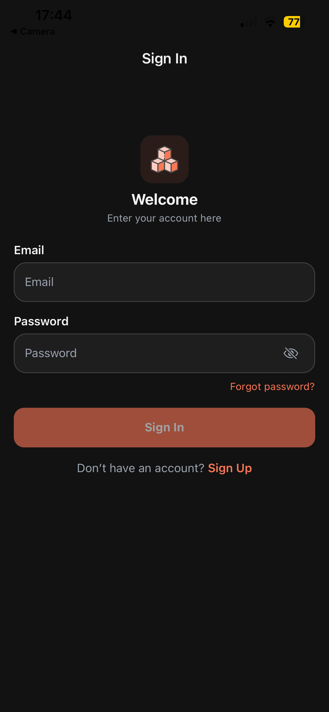</td>
    <td>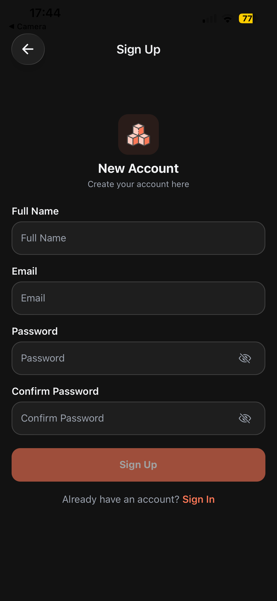</td>
  </tr>
    
  <tr>
    <td></td>
    <td></td>
    <td></td>
  </tr>
</table>

## How Notifications Work

1. User enables **"Notify when new jobs are added"** in profile settings.  
2. The app saves `notifyNewJobs = true` and `notifySince = serverTimestamp()` in Firestore.  
3. Whenever a new job with `publishedDate > notifySince` is added, a notification is created in `users/{uid}/notifications`.  
4. The user sees an alert and a red badge on the bell icon.  
5. Notifications can be opened, marked as read, or cleared.

## Setup & Run

1. Clone the repository  
   ```bash
   git clone https://github.com/golnooshA/job_tracker.git
   cd job_tracker

2. Install dependencies

   ```bash
   npm install
   ```

3. Configure Firebase

   * Create a Firebase project
   * Enable Authentication (Email/Password, Google, etc.)
   * Add Firestore
   * Replace Firebase config in `lib/firebase.ts`

4. Run the app

   ```bash
   npx expo start
   ```

## Future Improvements

* Push notifications (via Firebase Cloud Messaging)
* Job application tracking
* User profiles & resumes


